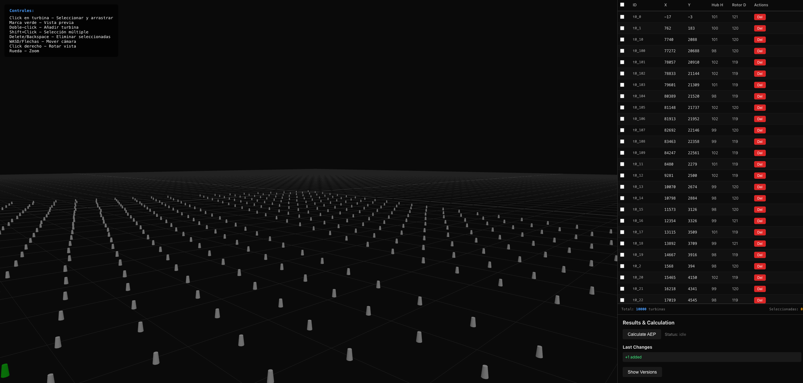

# Wind Farm Layout Sandbox

3D wind farm layout editor with real-time AEP calculation (Jensen/PARK model) and WebSocket synchronization.



## Features

- **3D Editor**: Three.js InstancedMesh for rendering 10k+ turbines
- **Data Table**: Virtualized table with keyset pagination
- **Real-time Sync**: WebSocket for layout changes, calculations, and telemetry
- **AEP Calculation**: Jensen/PARK wake model with Redis caching
- **Version Control**: Snapshot-based versioning with diff and restore
- **High Performance**: Optimized for large datasets

## Tech Stack

### Backend
- NestJS with hexagonal architecture
- PostgreSQL + Prisma
- Redis for caching
- WebSocket (ws library)

### Frontend
- React + Vite
- Three.js for 3D rendering
- TanStack Table + react-window
- TanStack Query

## Getting Started

### Prerequisites

- Node.js 20+
- Docker and Docker Compose
- npm or yarn

### Quick Start

```bash
# 1. Clone repository
git clone <repo-url>
cd Wind-Farm-Layout

# 2. Install dependencies
npm install

# 3. Start Docker services (PostgreSQL + Redis)
docker-compose up -d

# 4. Setup backend environment
cp backend/.env.example backend/.env

# 5. Run database migrations
cd backend
npx prisma generate
npx prisma migrate dev
cd ..

# 6. Seed database with 10,000+ turbines
npm run seed --workspace=backend

# 7. Start development servers (backend + frontend)
npm run dev
```

### Access Points

- **Frontend**: http://localhost:5173
- **Backend API**: http://localhost:3001
- **WebSocket**: ws://localhost:3001/ws
- **PostgreSQL**: localhost:5433
- **Redis**: localhost:6379
- **Prisma Studio**: `npx prisma studio` (from backend directory)

### Running Tests

```bash
# Backend unit tests
npm test --workspace=backend

# Backend E2E tests
npm run test:e2e --workspace=backend

# Frontend lint
npm run lint --workspace=frontend
```

## Architecture

```
/backend
  /src/core          # Domain layer (entities, use-cases, ports)
  /src/infra         # Infrastructure (HTTP, WS, Prisma, Redis)
  /prisma            # Database schema

/frontend
  /src/features      # Feature modules
  /src/lib           # Shared utilities
```

## Features in Detail

### 3D Visualization
- **InstancedMesh Rendering**: Efficiently renders 10,000+ turbines using Three.js
- **Interactive Controls**: 
  - Click turbines to select and drag them around
  - Double-click anywhere to add a new turbine (green preview marker shows where)
  - Shift+Click for multi-selection
  - Delete/Backspace to remove selected turbines
  - WASD or arrow keys for free camera movement
  - Right-click drag to rotate view
  - Mouse wheel to zoom
- **Real-time Updates**: Changes sync instantly via WebSocket with auto-reconnect

### Data Management
- **Virtualized Table**: TanStack Table with react-window for smooth scrolling
- **Keyset Pagination**: Efficient data loading for large datasets
- **Sorting & Filtering**: Client-side table operations
- **Bulk Operations**: Multi-select and batch delete

### AEP Calculation
- **Jensen/PARK Wake Model**: Industry-standard wake effect simulation
- **Redis Caching**: Results cached by layout hash for instant retrieval
- **Manual Calculation**: Click button to calculate (auto-calc disabled for better UX with large layouts)
- **Per-Turbine Metrics**: Individual AEP and wake deficit values

### Version Control
- **Manual Snapshots**: Save layout versions on demand (auto-save disabled for performance)
- **Diff Visualization**: See what changed between versions
- **Time Travel**: Restore any previous version
- **Change Tracking**: Added, removed, and moved turbines highlighted

### Real-time Sync
- **WebSocket Events**: `layout_changed`, `calc_status`, `telemetry`
- **Multi-client Support**: Changes broadcast to all connected clients
- **Room-based**: Clients join specific scenario rooms
- **Automatic Reconnection**: Exponential backoff (2s → 4s → 8s → max 10s)
- **Toast Notifications**: Success/error feedback for all operations

## API Reference

### REST Endpoints

```
GET    /scenario?id={id}                    # Get scenario details
GET    /scenario/turbines?scenarioId={id}   # List turbines (paginated)
POST   /scenario/turbines/move              # Move turbine
POST   /scenario/turbines/add               # Add new turbine
POST   /scenario/turbines/delete            # Delete turbine
POST   /scenario/calc                       # Calculate AEP
GET    /scenario/results/latest             # Get latest results
GET    /scenario/versions                   # List versions
POST   /scenario/versions/restore           # Restore version
GET    /scenario/diff/prev                  # Get diff with previous
```

### WebSocket Messages

**Client → Server:**
```json
{"event": "join", "data": {"scenarioId": "default"}}
```

**Server → Client:**
```json
{"event": "layout_changed", "data": {...}}
{"event": "calc_status", "data": {...}}
{"event": "telemetry", "data": {...}}
```

## Performance

- **10,000+ turbines** rendered smoothly using Three.js instancing
- **Instant operations**: Add/move/delete turbines in <100ms (no auto-save overhead)
- **Keyset pagination** for efficient data loading
- **Redis caching** reduces calculation time by 95%+
- **InstancedMesh** uses single draw call for all turbines
- **Virtualized table** renders only visible rows for smooth scrolling
- **Smart calculation**: Only compute AEP when you actually need it

## Development

### Project Structure

```
/backend
  /src/core          # Clean domain layer
    /entities        # Business entities
    /use-cases       # Application logic
    /ports           # Interface definitions
  /src/infra         # Technical implementation
    /http            # REST controllers
    /ws              # WebSocket gateway
    /persistence     # Prisma repositories
    /cache           # Redis cache
  /prisma            # Database schema & migrations
  /test              # E2E tests

/frontend
  /src/features      # Feature modules
    /scenario        # Main scenario feature
  /src/lib           # Shared utilities
    /api.ts          # API client
  /src/types         # TypeScript definitions
```

### Tech Decisions

- **Hexagonal Architecture**: Clean separation of domain and infrastructure
- **TDD Approach**: Core use cases developed test-first
- **InstancedMesh over Individual Meshes**: 100x performance improvement
- **Keyset Pagination over Offset**: Consistent performance at any page
- **WebSocket over Polling**: Real-time updates with minimal overhead
- **Snapshot Versioning**: Fast restore without complex event sourcing

## Contributing

This is an MVP. Potential improvements:

- [ ] Fix wake model angle calculation for proper deficit computation
- [ ] Add real turbine models (currently simple cylinders)
- [ ] Wind resource import (WRG, CFD)
- [ ] Energy calculation export (detailed CSV)
- [ ] Collaborative editing with CRDTs
- [ ] Terrain/obstacle visualization
- [ ] Optimization algorithms (genetic, gradient-based)
- [ ] Incremental snapshots instead of full saves

## License

MIT
